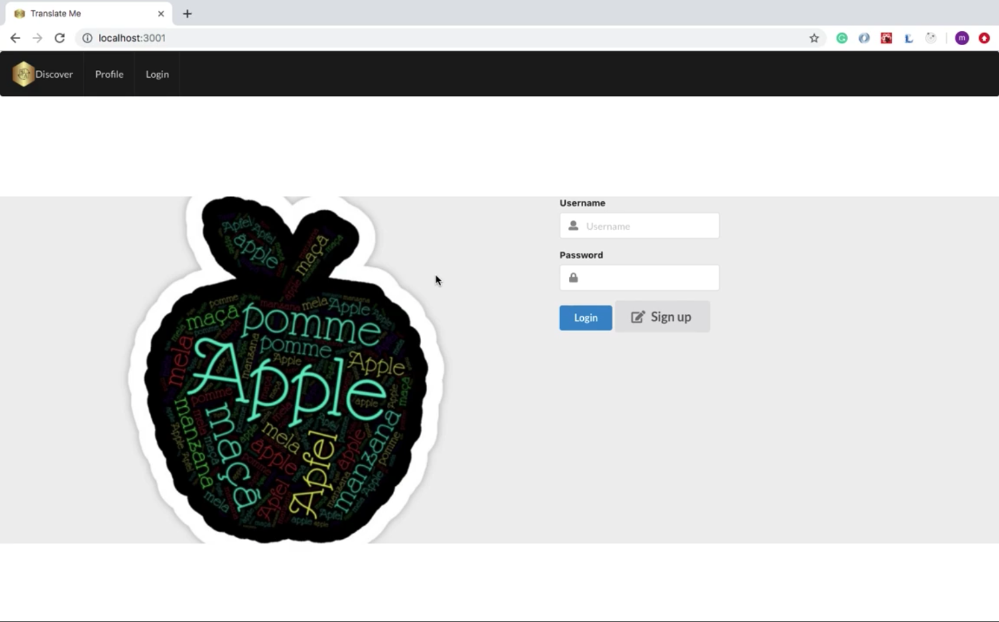
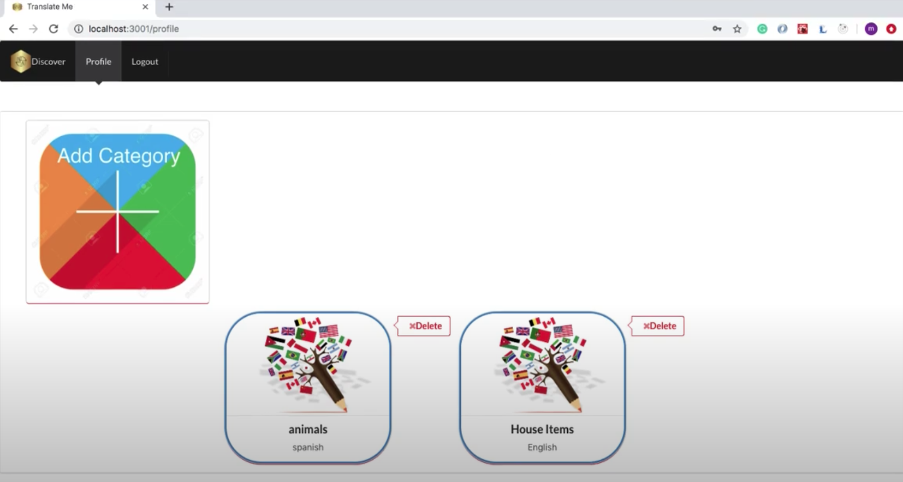
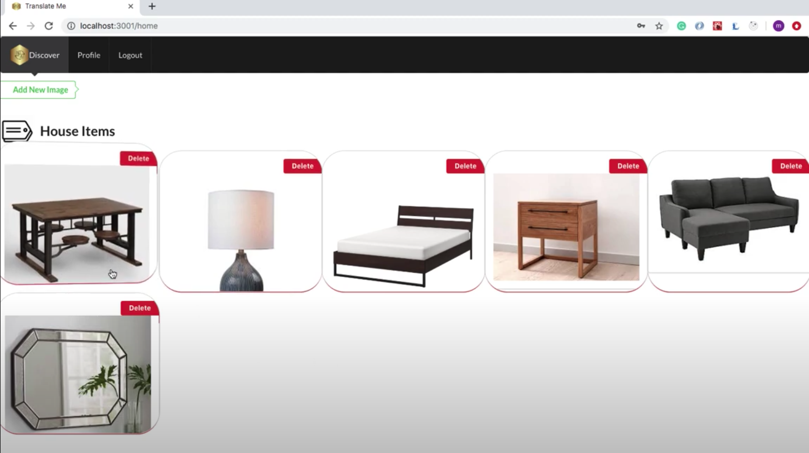
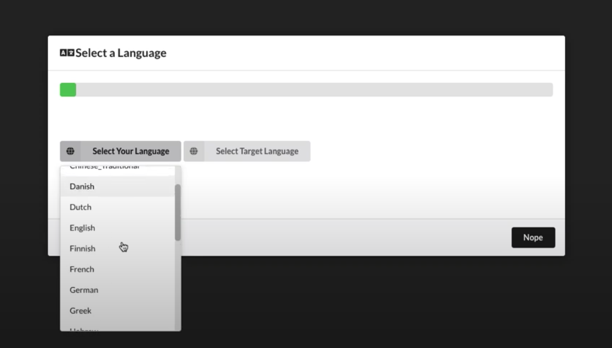

&nbsp; &nbsp; &nbsp; 

## TranslateMe Frontend

Translate me uses a machine learning technology to classify and translate images into different languages. Once the image is captured, users can flip the image to reveal the desired translated word for the image.

## Table of contents
* [General info](#general-info)
* [Technologies](#technologies)
* [images](#images)

## General info

Implemented a beautiful user interface employing React with Semantic-React for styling.
Developed a Rails API backend.
Implemented IBM Visual Recognition to classify images users upload.
Implemented IBM Language Translator to translate words users select
Utilized Cloudinary to save images users upload
	
## Technologies

Project is created with:
* React version: 16.8
* Cloudinary-react version: 1.1
* Semantic-ui-react version: 0.87
* Ruby version: 2.6
* IBM Watson version: 0.18

## Images

##### Login 
 

##### User 
 

##### Category 
 

##### Category 
 

